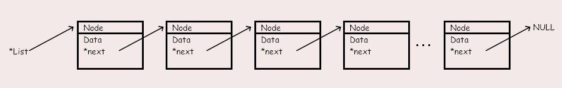
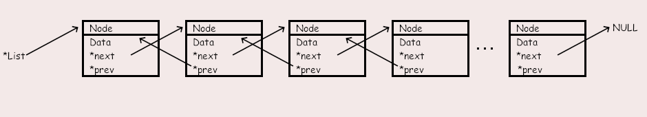
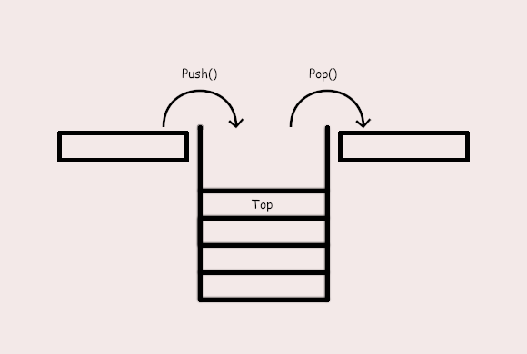

# C / C++ Examples
This repository contains several C and C++ Projects to show Examples for Data Structures like Lists, Stacks and Queues.

## Lists
Examples for Single and Double Linked Lists.

### Single Linked List

A single linked List is a List where each Node points at the following Node until there are no more Nodes. It is a pretty simple type of List with the disadvantage of not knowing what the parent Node is.

### Double Linked List

The double linked List contains Nodes with the Information of the previous and the next Node. 

## Stack

Examples of an Array based Stack and a List based Stack.

Stacks are Data Structures where you can Add (push) and Remove/Get (Pop) Data only from one End. This is known as the First in Last out (Filo) Principe.

## Queue
Queues are Data Structures where you can Add Data from one End but you can Access it only from the other End, known as First In First out (FIFO).

## Pointers 
A small collection to play with basic pointer functions.

## Matrix
The attempt to build a 2 Dimensional Matrix of the Size NxM.

## What is this for
This small "Tutorial" is more for my self to write down the basic things about C and Pointers. But if others find this useful they are invied to use and alter my stuff as they want. If you have some ideas for improvement, let me know!
